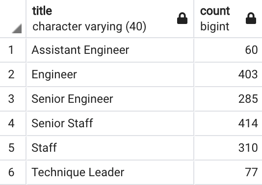

# **Pewlett-Hackard-Analysis**
- Employee data analysis of Pewlett Hackard company; storing the data in Postgres DB and querying using SQL through pgAdmin.
---
## Overview of the Project :
- Pewlett Hackard has large employee base with equally large number of senior employees who will be retiring soon. 
- Analysis will have to be conducted so that the number of employees about to retire is determined well in advance.
- The data on numbers retiring will help the company to plan on smooth exit and at the same time smooth onboarding of new employees so that the operations of the company goes on without any disturbance throughout the transition and further.
- The analysis should point out the projected numbers and the numbers impacting various departments and titles so that a strategy can be developed to handle the situation.
- The analysis should also give inputs on next set of senior employees who can participate in mentorship program mentoring new employees before they reach the retirement age.
- The queries written for the analysis can be found in .sql script file here : <a href="https://github.com/VinuthaBS/Pewlett-Hackard-Analysis/tree/main/Queries">------> SQL Script file</a>
- The exported data files are kept as .csv files here : <a href="https://github.com/VinuthaBS/Pewlett-Hackard-Analysis/tree/main/Data">------> .csv files</a>
## **Results :** 
- The analysis of employee data gave a clear understanding of the number of employees retiring shortly. Summary table of retirees v/s titles is as below :
- </img>
- The summary of the retiring employees based on the titles held discloses information on the fact that around 65% of the total number of retirees are senior staff (holding titles Senior Engineer and Senior Staff). This is a very big number of senior experienced positions who will have to be replaced. 
- Among the 9 active Managers (heading a department), 2 are set to retire. On further querying we can know that these 2 managers are from Sales and Research team. Summary table indicating the numbers v/s titles corresponding to departments reveals this information clearly as below :
- </img>
- Around 25% of the retirees are holding the titles "Engineer" or "Staff". This can be tackled by mentoring the junior employees.
- The data analysis on the employees eligible for mentorship program reveals that there are around 1500 employees. The number seems insufficient as the number of retiring employees are way more. Also when we see the breakup of the numbers in terms of titles held by these employees, surely there is a big gap in the senior titles (compare 350 for mentorship to around 28000 retirees). The summary table of the available employees for mentorship v/s titles reveals this information as below :
- </img>
---
## **Summary**
- Sales and Research team should gear up as their Managers are set to retire soon. For the smooth running of the company both these departments should focus on mentoring backup of atleast 2 more senior employees so that once the Manager retires atleast 1 of them can take up the responsibilities immediately.
- As the senior employees retiring are high in numbers, the corresponding departments should have a plan in place to step up the junior employees to shoulder the responsiblities. Refering the summary table with numbers v/s titles corresponding to departments is key.
- Though the complete total of retiring employees numbers are high, the analysis is done for a span of 4yrs so transition plan can be run in phased manner. 
- Employees eligible for mentorship program indicates that the numbers are very less when only a single year is considered. Hence to achieve desired numbers this also should be analysed considering employees for atleast 3 to 5 yrs span (may be birth date from 1963 - 1966).
---